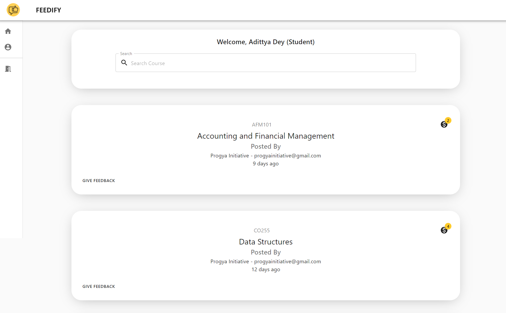
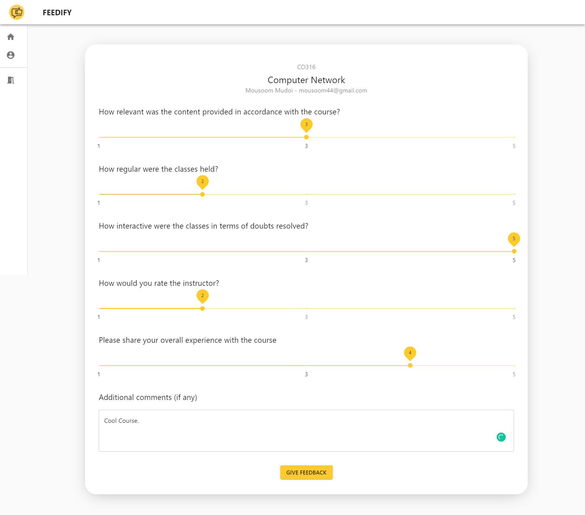
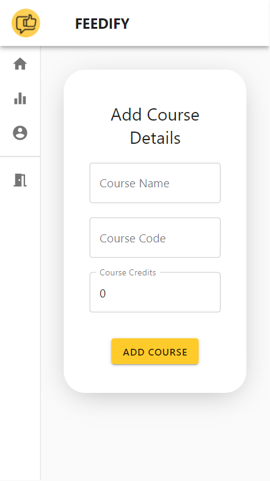

  

<h3 align="center">MuviRep - An open-source movie repository</h3>
 

## Demo
[Muvirep](https://adixcodr.github.io/muvirep/#/)

## Screenies

#### Desktop

#### Mobile

## Technologies used
* ReactJS
* Redux
* Firebase Bucket Storage

### Installing and running
* First install Yarn in your system from `https://classic.yarnpkg.com/en/docs/install`
* In root directory, Install the dependencies by `yarn`
* Run in browser with `yarn start`

 

### Author

#### [Adittya Dey](https://github.com/adiXcodr) ❤

